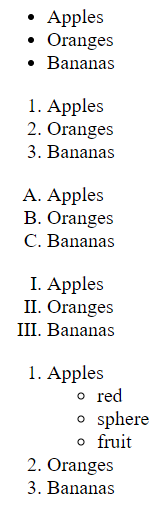

# HTML
## index.html
web browser consider `index.html` is homepage. 
<br><br>

## tag
HTML language is used to defines layout of pages using things called `tags` so I can create a series of tags and those tags will basically tell my web browser how I want my website to look and what content I want to have on my wesite. Furthermore, the things that have information of tag or file are called attributes or property. For example

```HTML
<!DOCTYPE html>
<html>
    <head>
        <meta charset="UTF-8">
        <meta name="description" content="This is an website">
        <title> Basic Website </title>
    </head>
    <body>
        Hello world
    </body>
</html>
```
charset, name, content are attributes or property giving different informations.
<br><br>

**※ basic sceletone of html**  
```HTML
<!DOCTYPE html>
<html>
    <head>
        <meta charset="UTF-8">
        <title> Basic Website </title>
    </head>
    <body>

    </body>
</html>
```

- `<!DocTYPE html>`: type of this document is html  
- `container tag`: tags are containing various other tags
- head: defines what document is
- body: description of document or containing other information
- web browser: basically parses a html tags. 
<br><br>

## terminology
Indent makes visually improve readability. When each tags have same indent, it means sibling. Similarly, inner indented tags mean child and outter indented tags mean parent.   
Abbreviation of word in braket < and > also has meanings. `<p></p>` is paragraph. `<b></b>` is bold. `<i></i>` is italic. `<br></br>` makes break and new line. `<hr/>` makes horizontal line. `<big></big>` and `<small></small>` control size of text font. Furthermore `<sub></sub>` and `<sup></sup>` make user design a location and size of character to various format.
meta tags shwos description of this file. 
<br><br>

## comment
```HTML
<!-- 
    web browser dosen't display this part. 
-->
```
<br>

## styles and colors
To style of html, we need a style attribute or CSS. First of all, browser set the style by an style attributes in paragraph tag.

```HTML
<p style="color:blue;">Styling blue</p>
<p style="color:red;">Styling red</p>
```
<br>

## formatting a page
HTML developer **should** consider right tags to layout page!! Most of pages are constructed to three sections: header, main, footer. These code gives more orgarnized document html. It takes a little extra time but it can increase the readability and also the possibility of file by search engine.
```HTML
<!DOCTYPE html>
<html>
    <head>
        <meta charset="UTF-8">
        <meta name="description" content="This is an practical website">
        <title> Basic Website </title>
    </head>
    <body>
        <header>
            <!-- Header Section -->
            <nav>
                <!-- navigational information -->
            </nav>
        </header>
        <main>
            <!-- Main Section -->
            <article>
                <!-- articles -->
                <section>
                    <!-- articles -->
                    <!-- not necessary but recommanded to be used within article tag -->
                </section>
                <section>
                    <aside>
                        <!-- for example: advertisement -->
                    </aside>
                </section>
            </article>
        </main>
        <footer>

        </footer>
    </body>
</html>
```
<br>

## link
By the link on href attributes in a tag, html can move to other web pages or other html files, any link.
```HTML
<!DOCTYPE html>
<html>
    <head>
        <meta charset="UTF-8">
        <meta name="description" content="This is an practical website">
        <title> Basic Website </title>
    </head>
    <body>
        <a href="https://google.com" target="_blank"><h1>Open up google in new tab</h1></a>
        <a href="https://google.com"><h1>Open up google in current tab</h1></a>
        <a href="page1.html">move to page1</a>
        <a href="cat.jpg">cat</a>
    </body>
</html>
```
<br>

## images
Inside image tag, we actually have to give it a couple of pieces of information. The first thing we want to give this image tag is the location of the image that we wnat to show. So when we have this image tag, we have to basically link it to an actual image. The actual link could be captured on any website easily. By wrapping the img tag by a tag, you can make clickable picture too. 

**src**  
>source of images (link, path all possible)   

**alt**  
>Alternative. When the src don't work, html shows the message.  

**width and height**  
>Control size. By only setting one, HTML will automatically adjust the `aspect ratio` for user.  

```HTML
<!DOCTYPE html>
<html>
    <head>
        <meta charset="UTF-8">
        <meta name="description" content="This is an practical website">
        <title> Basic Website </title>
    </head>
    <body>
        
        
        <a href="https://encrypted-tbn0.gstatic.com/images?q=tbn:ANd9GcQYfUCx4A6ww-bVMwoZudkJmjkmMtssI6ZWlw&usqp=CAU">
            
        </a>
    </body>
</html>
```
<br>

## videos and youtube iframes
- controls : give control video
- width or height : demanding width or height
- poster : thumbnail
- autoplay : video played automatically
- loop : start over when video finish  

**local video**
```HTML
<!DOCTYPE html>
<html>
    <head>
        <meta charset="UTF-8">
        <meta name="description" content="This is an practical website">
        <title> Basic Website </title>
    </head>
    <body>
        <video src="tutorial.mp4" controls width="300" poster="Avicii.jpg">video load failed</video>
    </body>
</html>
```
**YouTube iframe**
```HTML
<!DOCTYPE html>
<html>
    <head>
        <meta charset="UTF-8">
        <meta name="description" content="This is an practical website">
        <title> Basic Website </title>
    </head>
    <body>
        <iframe width="560" height="315" src="https://www.youtube.com/embed/ghNci2gUpSk" frameborder="0" allow="accelerometer; autoplay; clipboard-write; encrypted-media; gyroscope; picture-in-picture" allowfullscreen></iframe>
    </body>
</html>
```
<br>

## lists

```HTML
<!DOCTYPE html>
<html>
    <head>
        <meta charset="UTF-8">
        <meta name="description" content="This is an practical website">
        <title> Basic Website </title>
    </head>
    <body>
        <ul> <!-- un ordered list -->
            <li>Apples</li>
            <li>Oranges</li>
            <li>Bananas</li>
        </ul>

        <ol> <!-- ordered list -->
            <li>Apples</li>
            <li>Oranges</li>
            <li>Bananas</li>
        </ol>

        <ol type="A"> <!-- ordered list -->
            <li>Apples</li>
            <li>Oranges</li>
            <li>Bananas</li>
        </ol>

        <ol type="I"> <!-- ordered list -->
            <li>Apples</li>
            <li>Oranges</li>
            <li>Bananas</li>
        </ol>

        <ol> <!-- ordered list -->
            <li>Apples
                <ul>
                    <li>red</li>
                    <li>sphere</li>
                    <li>fruit</li>
                </ul>
            </li>
            <li>Oranges</li>
            <li>Bananas</li>
        </ol>

        <dl>
            <dt>This is description list</dt>
            <dd>- Description -</dd>
        </dl>
    </body>
</html>
```
<br>

## table
- **tr**: horizontal entry, table row
- **td**: table data
- **th**: table head like keys of information about column
- they resize their shape automatically
- **caption**: table name
- most of table generally has a shape as two part, table head and table body
- **colspan**: each individual data take how many columns
```HTML
<!DOCTYPE html>
<html>
    <head>
        <meta charset="UTF-8">
        <meta name="description" content="This is an practical website">
        <title> Basic Website </title>
    </head>
    <body>
        <table>
            <thead>
                <caption>information</caption>
                <tr>
                    <th>name</th>
                    <th>age</th>
                    <th>height</th>
                </tr>
            </thead>
            <tbody>
                <tr>
                    <td colspan="2">CH</td>
                    <td>26</td>
                    <td>178</td>
                </tr>
            </tbody>
        </table>
    </body>
</html>
```

<br>

## divs and spans
**inline element** example
```HTML
<a href="#">link1</a>
<a href="#">link2</a>
```
As you see, these are able to sit right next to each element. On the other, paragraph are not able to set next to element eventhough the first one has enough room. 
```HTML
<p>paragraph1</p>
<p>paragraph2</p>
```
First one is called `inline container` and second one is called `block container`. `span` tag are inline container and `div` tag is block container. You can check the big difference of the examples executing the html code. Maintaining this property, they can contain any information or text in the tags.
```HTML
<span>span1</span>
<span>span2</span>
<div>div1</div>
<div>div2</div>
```
<br>

## input and forms
- `<input type="text"/>`: general input
- `<input type="password"/>`: password
- `<input type="text" value="default text"/>`: first seen text
- `<input type="date"/>`, `<input type="email"/>`, `<input type="range"/>` are also possible.
- **textarea**: user can text any text in the area. It's able to specified to exact size by rows and cols.
- **form**: wraping the input. inputs could be trasfered with information within form tag.  

[*[more information about input types]*](https://www.w3schools.com/html/html_form_input_types.asp)
```HTML
<!DOCTYPE html>
<html>
    <head>
        <meta charset="UTF-8">
        <meta name="description" content="This is an practical website">
        <title> Basic Website </title>
    </head>
    <body>
        <input type="text"/>
        <input type="password"/>
        <input type="text" value="Enter your email">
        <textarea rows="10" cols="30">
        </textarea>
        <input type="date"/>
        <input type="range"/>
        <input type="email" value="email"/>
        <input type="file"/>
        <input type="checkbox"/>
        <input type="submit"/>

        <!-- if they have same name, user is only able to choose one item-->
        <input name="btn" type="radio"/>
        <input name="btn" type="radio"/>
    </body>
</html>
```
<br>

## iFrames
Big websites sometimes block iFrame. One reason is some bad developer can trick some user by displaying website with iFrame.
```
<!DOCTYPE html>
<html>
    <head>
        <meta charset="UTF-8">
        <meta name="description" content="This is an practical website">
        <title> Basic Website </title>
    </head>
    <body>
        <iframe src="http://giraffeacademy.com/" width="1000" height="800" border="0">Here</iframe>
    </body>
</html>
```
<br>

## Meta tag
Most commonly used meta tags to be searched for engine or define html files.
```HTML
<!DOCTYPE html>
<html>
    <head>
        <meta charset="UTF-8">
        <meta name="description" content="This is an practical website">
        <meta name="author" content="wch18735">
        <meta name="keywords" content="HTML, Tutorial, GitHub">
        <meta name="viewport" conten="width=device-width, initial-scale=1.0">
        <title> Basic Website </title>
    </head>
    <body>
        <h1>Meta Tags</h1>
    </body>
</html>
```

# TODO
- [ ] Apply Grid layout
- [ ] Change Thumbnail